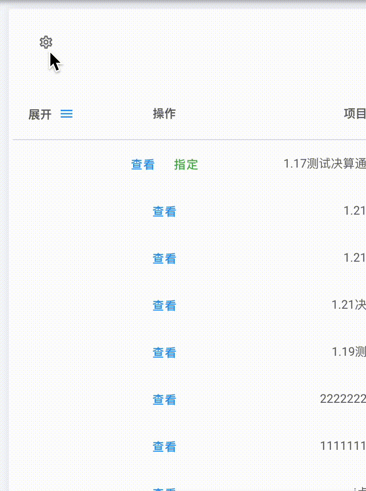

# transition-lib-vue3
vue3的一个“过渡组件”库

## ExpandTransition(展开)

### 使用方法
```html
<expand-transition>
  <card v-if="visible">
    <!-- do something -->
  </card>
</expand-transtion>
```
### 效果


---

## InterlaceTransition(列表交错过渡)

### 使用方法
```html
<interlace-transition>
  <template v-if="visible">
    <li v-for="i of 10">
          {{i}}
    </li>
  </template>
</interlace-transition>
```
### 效果
